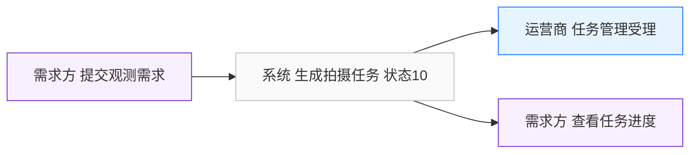
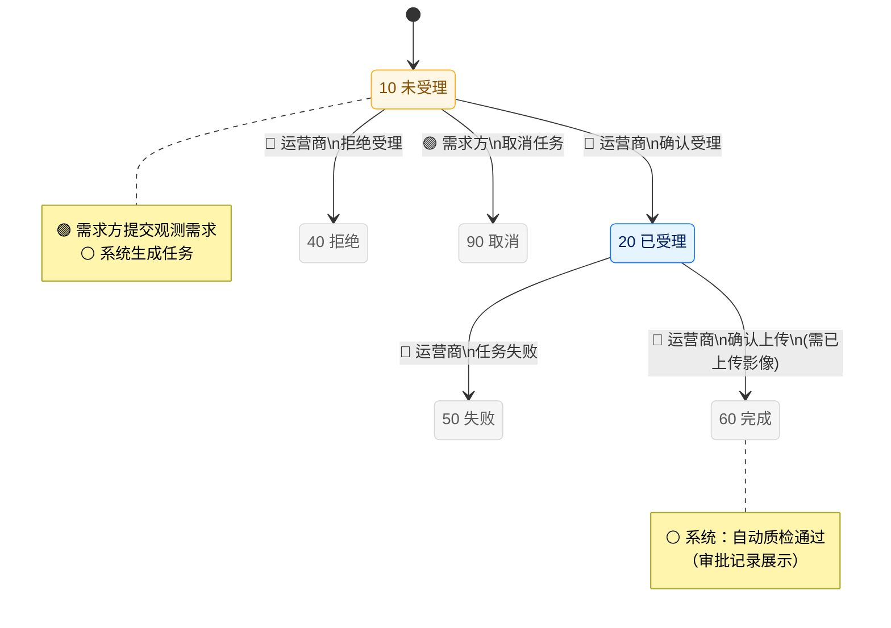
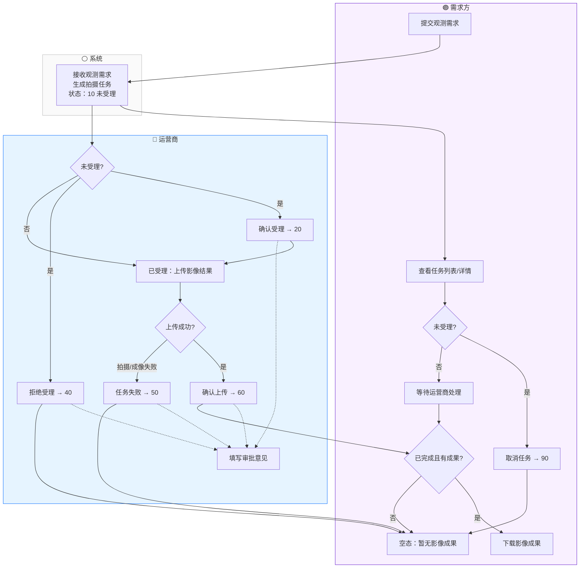
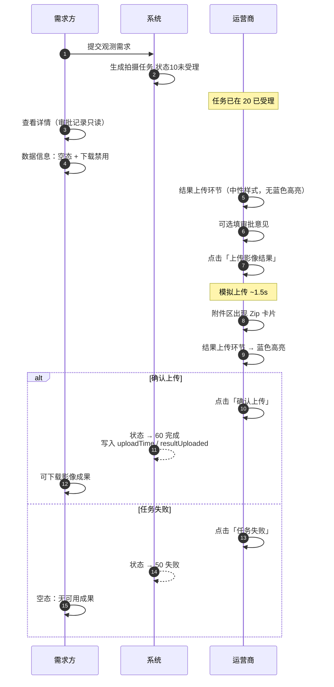
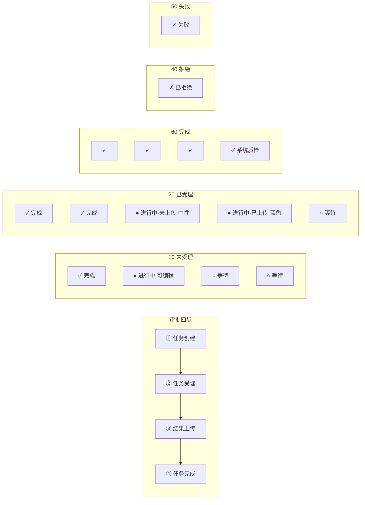
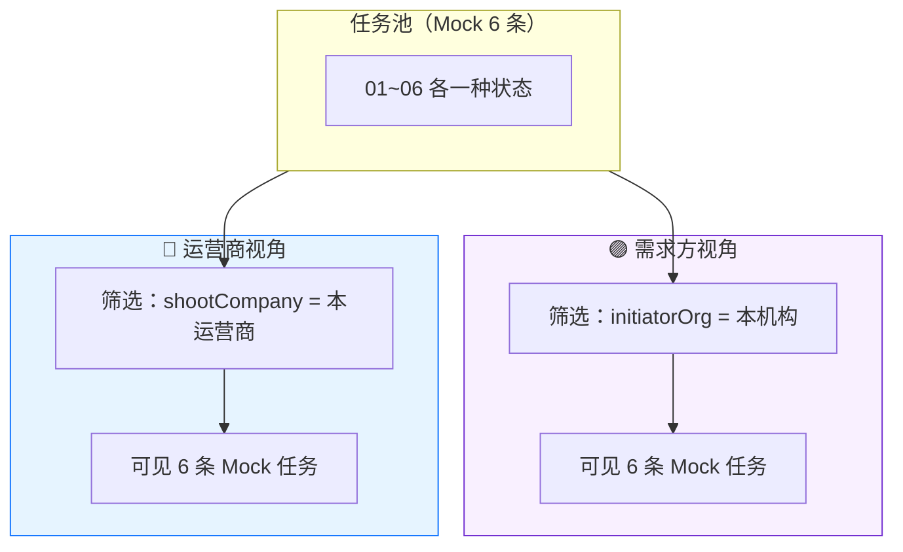

# 任务管理 — 业务流程图

> 与前端代码分离的独立流程文档。Mermaid 源码可直接在 Cursor、GitHub、语雀、飞书等支持 Mermaid 的工具中渲染。  
> 状态定义详见 [task-state-machine.md](./task-state-machine.md)。

---

## 图例

| 角色 | 颜色标识 | 说明 |
|------|----------|------|
| 需求方 | 🟣 紫色 | 提交观测需求、发起单位用户 |
| 运营商 | 🔵 蓝色 | 拍摄单位（供应商） |
| 系统 | ⚪ 灰色 | 接收需求后生成任务、自动质检等 |

---

## 图 0 · 任务来源（业务起点）

---

## 图 1 · 任务主状态机（按角色标注流转）

---

## 图 2 · 端到端泳道流程（主路径 + 分支）

---

## 图 3 · 已受理（20）子流程：上传与确认

> 主状态保持 `20`，直到运营商点击「确认上传」或「任务失败」。

---

## 图 4 · 审批子流程 × 主状态矩阵

**图例：** ✓ 已完成 · ● 进行中 · ○ 未开始 · ✗ 异常/拒绝

---

## 图 5 · 双视角数据可见范围

---

## 使用说明

1. **预览：** 在 VS Code / Cursor 安装 Mermaid 插件，或使用 GitHub 直接预览 `.md` 文件。
2. **导出图片：** 复制 Mermaid 代码块到 [mermaid.live](https://mermaid.live) 导出 PNG/SVG。
3. **同步维护：** 前端状态逻辑变更时，先更新 `task-state-machine.md`，再更新本文件中的图。
4. **与代码关系：** 本文档不引用、不修改任何 `.js` / `.html` 文件。

---

## 修订记录

| 日期 | 说明 |
|------|------|
| 2026-05-25 | 初版，含状态机图、泳道图、上传子流程、审批矩阵、视角范围图 |
| 2026-05-25 | 明确任务来源：需求方提交观测需求 → 系统生成任务 |
