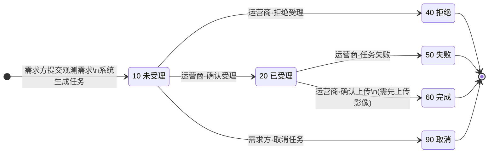

# 任务管理 — 状态机说明

> 本文档描述当前前端 Demo 中「观测需求 · 任务管理」的业务状态机，与 `app.js` 等业务代码**相互独立**，作为产品/研发共识契约使用。  
> 对应页面：任务列表、任务详情（任务审批 / 审批记录、数据信息）。

---

## 1. 参与角色

| 角色 | 说明 | Demo 中的视角切换 |
|------|------|---------------------|
| **需求方** | 观测需求的发起方：提交观测需求后产生任务，可查看本机构任务、未受理时可取消、完成后可下载成果 | 顶栏「需求方」 |
| **运营商** | 拍摄单位（供应商），负责受理/拒绝、上传影像、确认上传或上报失败 | 顶栏「运营商」 |
| **系统** | 需求方提交观测需求后，自动拆分/生成拍摄任务；任务完成时执行自动质检（展示层） | 无独立 UI，仅在流程中标注 |

---

## 1.1 任务来源（业务起点）

**任务由需求方提交观测需求而来**，不是运营商或系统凭空创建：

```
需求方提交观测需求 → 系统生成拍摄任务（状态 10 未受理）→ 运营商受理处理
```

| 环节 | 操作角色 | 说明 |
|------|----------|------|
| 提交观测需求 | **需求方** | 上游「观测需求」模块，填写拍摄范围、交付要求等 |
| 生成拍摄任务 | **系统** | 一条或多条观测需求可拆分为若干拍摄任务，初始状态 `10` |
| 任务管理 | 需求方 / 运营商 | 本文档及当前 Demo 所覆盖的范围 |

Demo 中以 Mock 数据直接呈现已生成的任务，省略「提交观测需求」页面，但业务上**创建人、发起单位均归属需求方**。

---

## 2. 任务主状态（6 态）

| 状态码 | 名称 | 类型 | 列表 Tag 语义 |
|--------|------|------|---------------|
| `10` | 未受理 | 初始态 | 任务已生成，等待运营商响应 |
| `20` | 已受理 | 进行中 | 运营商已受理，等待拍摄与成果上传 |
| `40` | 拒绝 | **终态** | 运营商拒绝受理 |
| `50` | 失败 | **终态** | 已受理后拍摄/上传失败 |
| `60` | 完成 | **终态** | 成果已确认上传，可交付 |
| `90` | 取消 | **终态** | 需求方在未受理时取消 |

**终态集合：** `40` 拒绝、`50` 失败、`60` 完成、`90` 取消。  
终态下**不允许**任何状态回退或再次流转。

**业务起点：** **需求方**在「观测需求」中提交需求 → **系统**自动生成拍摄任务 → 初始状态 `10` 未受理（Demo 中以 Mock 数据直接呈现）。

---

## 3. 状态流转规则

所有流转均为**单向**，操作前需二次确认。

### 3.1 从未受理（10）出发

| 目标状态 | 操作角色 | 用户操作（UI 文案） | 前置条件 |
|----------|----------|---------------------|----------|
| `20` 已受理 | 运营商 | 确认受理 | 无 |
| `40` 拒绝 | 运营商 | 拒绝受理 | 无 |
| `90` 取消 | 需求方 | 取消任务 | 任务处于未受理；列表/详情均可触发 |

### 3.2 从已受理（20）出发

| 目标状态 | 操作角色 | 用户操作（UI 文案） | 前置条件 |
|----------|----------|---------------------|----------|
| `60` 完成 | 运营商 | 确认上传 | **必须先成功上传影像成果**（本地附件区出现 Zip 卡片） |
| `50` 失败 | 运营商 | 任务失败 | 无 |

### 3.3 终态

`40` / `50` / `60` / `90` 无后续合法流转。

---

## 4. 流转副作用（字段更新）

操作成功后，Demo 会同步更新以下业务字段（便于列表/详情展示）：

| 触发操作 | 更新字段 |
|----------|----------|
| 确认受理 → `20` | `acceptTime`、`preShootTime`（若为空则写入当前时间） |
| 拒绝受理 → `40` | `actualFinishTime` |
| 取消任务 → `90` | `actualFinishTime` |
| 确认上传 → `60` | `uploadTime`、`actualFinishTime`、`resultUploaded = true`、成果影像 |
| 任务失败 → `50` | `actualFinishTime` |

**审批意见：** 受理/拒绝/确认上传/失败时，会一并保存当前环节已填写的审批意见（选填）。

---

## 5. 数据标记：影像是否已上传

除主状态外，存在**子数据标记** `resultUploaded` / 附件列表，用于 UI 联动（**不改变主状态**）：

| 主状态 | 影像上传标记 | 含义 |
|--------|--------------|------|
| `20` 已受理 | 未上传 | 运营商可点击「上传影像结果」，审批「结果上传」为中性样式 |
| `20` 已受理 | 已上传 | 附件区出现 Zip 卡片，「确认上传」按钮可用，「结果上传」环节蓝色高亮 |
| `60` 完成 | 已上传 | 需求方可下载；审批「结果上传」为已完成 |

> **要点：** 「上传影像成功」≠ 任务完成；必须再执行「确认上传」才会进入 `60` 完成。

---

## 6. 审批子流程（与主状态并行）

审批时间线共 **4 步**，与主状态**相关但不同步完全等价**：

| 步骤 | 名称 | 需填写审批意见 | 说明 |
|------|------|----------------|------|
| 1 | 任务创建 | 否 | **需求方提交观测需求后**，由系统生成任务并自动完成此步 |
| 2 | 任务受理 | 是（运营商） | 未受理时为进行中；拒绝为异常终态 |
| 3 | 结果上传 | 是（运营商） | 已受理时为进行中；完成/失败为终态展示 |
| 4 | 任务完成 | 否 | 仅 `60` 完成时标记完成；**无输入框** |

### 6.1 审批 UI 与主状态对照

| 主状态 | 任务创建 | 任务受理 | 结果上传 | 任务完成 |
|--------|----------|----------|----------|----------|
| `10` 未受理 | 已完成 | **进行中**（运营商可编辑） | 等待 | 等待 |
| `20` 已受理 | 已完成 | 已完成 | **进行中**（未上传：中性；已上传：蓝色高亮） | 等待 |
| `40` 拒绝 | 已完成 | **已拒绝** | 等待 | 等待 |
| `50` 失败 | 已完成 | 已完成 | **失败** | 等待 |
| `60` 完成 | 已完成 | 已完成 | 已完成 | **已完成**（系统：自动质检通过） |
| `90` 取消 | 已完成 | 等待 | 等待 | 等待 |

---

## 7. 角色权限矩阵

### 7.1 列表页

| 能力 | 需求方 | 运营商 |
|------|--------|--------|
| 数据范围 | 本机构发起任务 | 本运营商拍摄任务 |
| 筛选·发起单位 | 锁定本机构 | 可多选 |
| 筛选·拍摄单位 | 可多选 | 锁定本运营商 |
| 全部任务 / 待我处理 | 无（仅全部） | 有 |
| 取消任务 | 未受理时可取消 | — |
| 导出任务 | 需勾选行 | 需勾选行 |

**待我处理定义：**

- 需求方：未受理 **且** 创建人为当前用户
- 运营商：未受理 **或** 已受理

### 7.2 详情页

| 能力 | 需求方 | 运营商 |
|------|--------|--------|
| 任务审批模块标题 | 审批记录（只读） | 任务审批（可操作） |
| 填写审批意见 | 否 | 当前进行中环节可填 |
| 确认受理 / 拒绝受理 | 否 | 未受理时 |
| 取消任务 | 未受理时 | 否 |
| 上传影像结果 | 否 | 已受理时 |
| 确认上传 / 任务失败 | 否 | 已受理时 |
| 下载影像成果 | 完成且已有成果 | 否 |
| 成果预览地图 | 可查看 | 可查看 |

### 7.3 需求方·数据信息空态

| 主状态 | 影像区展示 | 下载按钮 |
|--------|------------|----------|
| 未受理 / 已受理 | 空态「暂无影像成果」 | 禁用 |
| 拒绝 / 失败 / 取消 | 空态「该任务未产生可交付成果」 | 禁用 |
| 完成且有成果 | Zip 文件卡片 | 可用 |
| 完成但无成果 | 空态「成果处理中」 | 禁用 |

---

## 8. 系统参与点

| 环节 | 操作角色 | 系统行为 | 是否改变主状态 |
|------|----------|----------|----------------|
| 需求方提交观测需求 | **需求方** | 系统接收需求并生成拍摄任务，状态 `10` | 是（创建） |
| 任务完成时 | **系统** | 审批记录展示「自动质检通过，准予交付」 | 否（展示层文案） |

---

## 9. Demo Mock 任务对照（验收用）

| 任务 ID | 主状态 | 用途 |
|---------|--------|------|
| 01 | `10` 未受理 | 需求方取消、运营商受理/拒绝 |
| 02 | `20` 已受理 | 上传影像 → 确认上传 / 失败 |
| 03 | `40` 拒绝 | 终态只读 |
| 04 | `50` 失败 | 终态只读 |
| 05 | `60` 完成 | 需求方下载成果 |
| 06 | `90` 取消 | 终态只读 |

---

## 10. 状态机图（Mermaid）



---

## 11. 修订记录

| 日期 | 说明 |
|------|------|
| 2026-05-25 | 初版，对齐当前前端 Demo 全流程 |
| 2026-05-25 | 明确任务来源：需求方提交观测需求 → 系统生成任务 |
